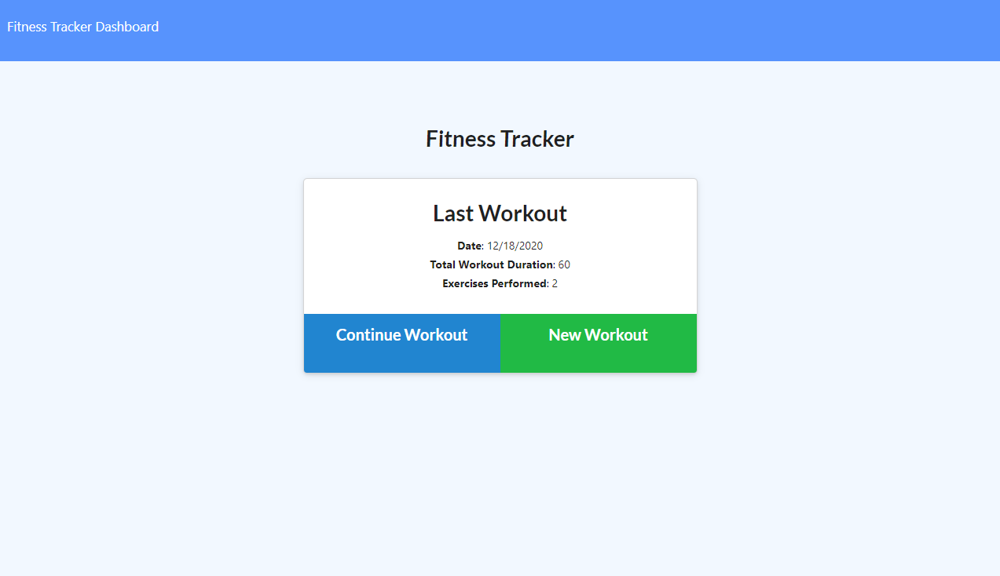
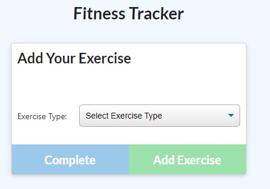
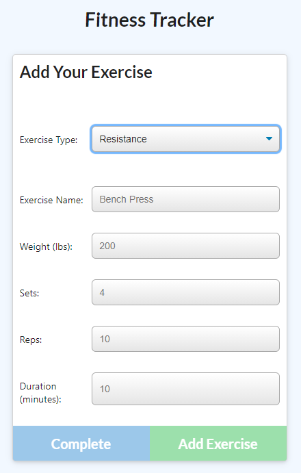
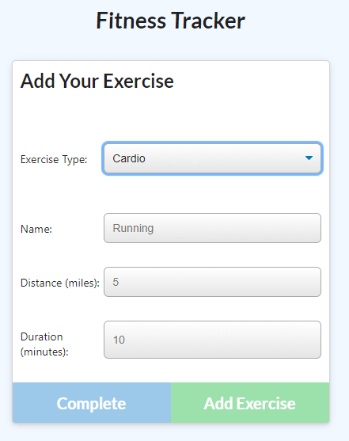
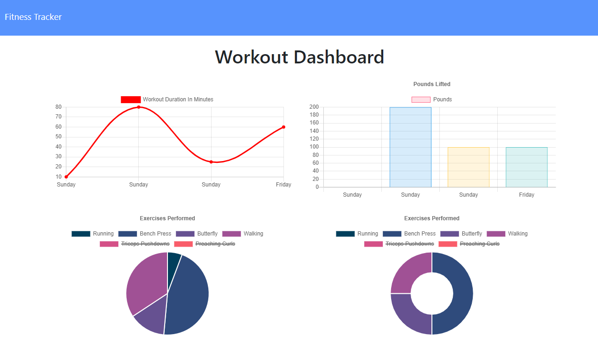

# Workout-Tracker



[App Live on Heroku](https://peaceful-dusk-42448.herokuapp.com/?id=5fe026173fc08b0f4fe3d5a9)

---

### Table of Contents

- [Description](#description)
- [How to Use](#how-to-use)
- [Screenshots](#screenshots)
- [References](#references)
- [License](#license)
- [Author Info](#author-info)

---

## Description

The goal of this project is to create a workout tracker. This app will require to create Mongo database with a Mongoose schema and handle route with Express. The user will be able to create and tack daily workouts. Also It will be able to log multiple exercises in a workout on a given day. The user should also be able to track the name, type, weight, sets, reps, and duration of exercise. If the exercise is a cardio exercise, I should be able to track my distance traveled.

#### Technologies

- JavaScript
- NPM Modules
- Visual Studio Code
- Node.js
- Package.json
- Mongodb
- Express
- Mongoose

##### Code sample - JavaScript - Connection to a Databse 
#

```js
const express = require("express");
const mongoose = require("mongoose");

const PORT = process.env.PORT || 3000;

const app = express();


app.use(express.urlencoded({ extended: true }));
app.use(express.json());

app.use(express.static("public"));

mongoose.connect(process.env.MONGODB_URI || "mongodb://localhost/workout", {
  useNewUrlParser: true,
  useUnifiedTopology: true,
  useCreateIndex: true,
  useFindAndModify: false
});

// routes
app.use(require("./routes/api.js"));
require("./routes/html-routes.js")(app);

app.listen(PORT, () => {
  console.log(`App running on port ${PORT}!`);
});

```
##### Code sample - package.json
#
```json
 {
  "name": "mongoose_skeleton",
  "version": "1.0.0",
  "description": "",
  "main": "server.js",
  "scripts": {
    "test": "echo \"Error: no test specified\" && exit 1",
    "start": "node server.js",
    "watch": "nodemon server.js",
    "seed": "node seeders/seed.js"
  },
  "author": "",
  "license": "ISC",
  "dependencies": {
    "express": "^4.16.3",
    "mongoose": "^5.3.16",
    "morgan": "^1.9.1"
  }
}

```

##### Code sample - javaScript - Functions to interact with the Database using a model file
#
```js
 const mongoose = require("mongoose");

const Schema = mongoose.Schema;

const workoutSchema = new Schema(
{
  day: {
    type: Date,
    default: Date.now,
    required: "Date for workout must be entered"
  },
  exercises: [
    {
      type: Schema.Types.ObjectId,
      ref: "Exercise"
    }
  ],
  totalDuration: {
    type: Number
  }
});

const Workout = mongoose.model("Workout", workoutSchema);

module.exports = Workout;

```
---
## How To Use

This application is running on a webpage deployed on Heroku. When the user loads the page, they should be given the option to create a new workout or continue with their last workout.

The user should be able to:

  * Add exercises to the most recent workout plan.

  * Add new exercises to a new workout plan.

  * View the combined weight of multiple exercises from the past seven workouts on the `stats` page.

  * View the total duration of each workout from the past seven workouts on the `stats` page.

[Back To The Top](#Workout-Tracker)
 
## Screenshots

- Add New Exercise form. 



- Resistance Exercise form. 



- Cardio Exercise form.



- Dashboard.



[Back To The Top](#Workout-Tracker)

---

## References

- w3school -- [Node.js NPM](https://www.w3schools.com/nodejs/nodejs_npm.asp)
- NPM -- [Node Package Managment](https://www.npmjs.com/)
- Inquirer -- [Inquirer module](https://www.npmjs.com/package/inquirer)
- Node.js -- [About Node.js](https://nodejs.org/en/)
- json -- [The package.json guide](https://nodejs.dev/learn/the-package-json-guide)
- Mongodb -- [Mongodb](https://docs.mongodb.com/manual/reference/resource-document/)
- Express -- [express module](https://www.npmjs.com/package/express)


[Back To The Top](#Workout-Tracker)

---

## License

Copyright (c) [2020] [Cesar A Martinez]

[Back To The Top](#Workout-Tracker)

---

## Author Info

- Twitter -- [@cesaguma](https://twitter.com/cesaguma)
- Linkedin -- [Cesar A Martinez](https://www.linkedin.com/in/cesar-augusto-martinez-auquilla-03934a16b/)
- GitHub -- [CesarAugustoMartinez](https://github.com/CesarAugustoMartinez)

[Back To The Top](#Workout-Tracker)
